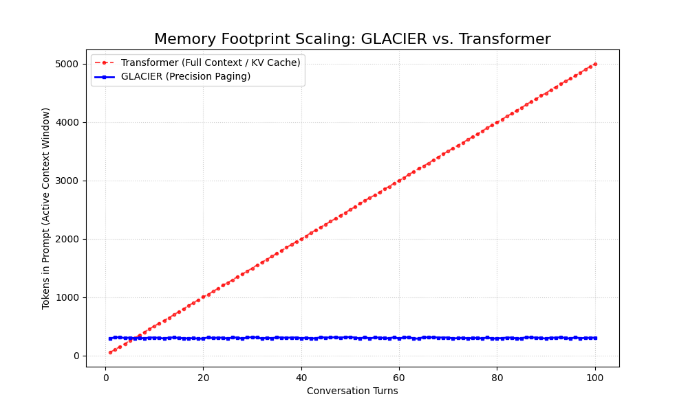

# GLACIER: Mamba with Infinite Memory

**GLACIER** is an open-source project by **Dopove Private Limited** that gives State Space Models like Mamba a persistent, time-aware memory. It solves context rot by integrating a lightweight virtual memory engine (`ICE-Lite`) and a temporal reranking layer (`Temporal-RAG`), ensuring models retain long-term memory while remaining fast and efficient.

This project was architected and built by **Saran S**, Founder & CEO of Dopove.

- **GitHub:** [https://github.com/Saran-386](https://github.com/Saran-386)
- **Dopove:** [https://www.dopove.com/](https://www.dopove.com/)

---

## 🚀 Quick Installation (v0.1.0)

For a fast setup on Linux with CUDA, you can install the pre-built `glacier-ice-lite` wheel directly:

```bash
pip install https://github.com/Dopove/Glacier/releases/download/v0.1.0/glacier_ice_lite-0.1.0-py3-none-any.whl
```

---

## Key Features

*   **Persistent Memory:** Stop and restart sessions with full memory recall.
*   **Temporal-Aware RAG:** A time-decay and validity-aware retrieval layer prevents the model from using stale information.
*   **Agentic Capabilities:** Native support for multi-step tool use, "Turbo-Stitching" for long-form generation, and file ingestion.
*   **$O(1)$ Inference Speed:** Retains the core speed advantage of Mamba by managing all memory externally.

---

## Benchmarks: GLACIER vs. Transformers

GLACIER's architecture is significantly more efficient than traditional Transformer models for long conversations. By avoiding a full-context KV-cache, it maintains constant speed and a minimal token footprint.



> **[Read the Full Benchmark Report](./docs/benchmark.md)**

### 📖 Deep Dives: Architecture & Competitors
Explore the core principles that make GLACIER superior to standard RAG and memory wrappers:
*   **[Visual Architecture Overview](./docs/architecture/glacier_overview.md)**: Mamba's External Hippocampus.
*   **[Defeating Context Rot](./docs/architecture/context_rot_mitigation.md)**: How we solve SSM amnesia.
*   **[Multi-Tiered Memory](./docs/architecture/memory_layers.md)**: The 100 Billion Token Horizon.
*   **[GLACIER vs. The Competition](./docs/competitors.md)**: Why our architecture wins against Mem0, Zep, and LangGraph.

---

## Getting Started: The Guaranteed Method (Docker)

To guarantee a perfectly configured environment with all CUDA dependencies, we strongly recommend using Docker.

```bash
# 1. Build the Docker image (this will take 10-15 minutes)
docker build -t glacier .

# 2. Run the full benchmark suite inside the container
docker run --gpus all glacier
```

This is the fastest and most reliable way to run GLACIER.

### Alternative: Local Installation (Advanced)

<details>
<summary>Click here for local installation instructions</summary>

**Warning:** Installing `mamba_ssm` from source is complex and requires a specific CUDA and C++ compiler environment. This method is only recommended for advanced users.

**Prerequisites:**
- NVIDIA GPU with CUDA Toolkit 12.1 installed.
- A compatible C++ compiler (e.g., `gcc-11` or `gcc-12`).

```bash
# 1. Create and activate a virtual environment
python3 -m venv .venv && source .venv/bin/activate

# 2. Install dependencies (this will compile CUDA extensions)
pip install -r requirements.txt

# 3. Download embedding models (if not already present)
mkdir -p ~/.cache/ice/models/
wget https://huggingface.co/Xenova/all-MiniLM-L6-v2/resolve/main/onnx/model_quantized.onnx -O ~/.cache/ice/models/model.onnx
wget https://huggingface.co/Xenova/all-MiniLM-L6-v2/resolve/main/tokenizer.json -O ~/.cache/ice/models/tokenizer.json

# 4. Run the full benchmark suite
python tests/test_glacier.py
```
</details>

### Deploying to HuggingFace Spaces
You can deploy the interactive Gradio demo (`examples/app.py`) to HuggingFace Spaces in minutes. See the [Getting Started guide](./docs/getting_started.md) for more details.

## Project Structure
```text
/
├── src/ice_lite/         # The core ICE-Lite Python package
├── vendor/mamba_ssm/     # Mamba2 source (from state-spaces/mamba)
├── temporal_rag.py       # The Temporal-RAG source (by Emmimal P Alexander)
├── tests/                # Test suites
│   ├── test_glacier.py   # The full GLACIER benchmark test suite
│   └── test_agentic_features.py # Tests for tool use, stitching, and ingestion
├── examples/             # Demos and examples
│   └── app.py            # Gradio demo for HuggingFace Spaces
├── docs/                 # All project documentation
├── setup.py              # Packaging script for the `glacier` package
├── requirements.txt
└── LICENSE               # Main project license (Apache 2.0)
```

## Contributing
We welcome contributions! Please see our [Contributing Guide](./CONTRIBUTING.md) for details on how to get started.

## License

This project is licensed under the Apache License 2.0. See the `LICENSE` and `NOTICE` files for full details, including third-party component licenses.
