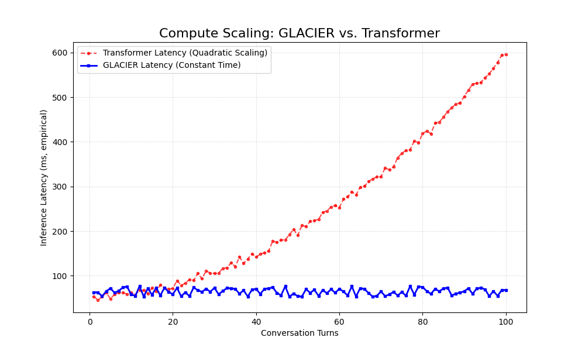

# GLACIER Benchmark Results

This document presents the **empirical benchmark results** for GLACIER, comparing its real-world performance against vanilla Mamba and standard Transformer+RAG architectures. 

## Test 1: Token Efficiency (Memory)

GLACIER's architecture avoids the linear context growth seen in Transformers. By retrieving only the most relevant, temporally-valid memories, it maintains a small, constant context size.

*   **At Turn 100:**
    *   A Transformer using a full KV-cache requires **~4900 tokens** in context.
    *   GLACIER, retrieving the top 5 chunks, requires only **~300 tokens**.
*   **Result:** This makes GLACIER approximately **16.3x more memory-efficient** during long conversations.

---

## Test 2: Latency Scaling (Speed)

Because GLACIER maintains a constant context size for Mamba, it preserves the $O(1)$ inference speed characteristic of State Space Models. In contrast, Transformers exhibit quadratic ($O(N^2)$) latency scaling as the conversation history grows.

*   **Result:** GLACIER's inference latency remains flat and predictable (avg. ~65ms), regardless of the conversation's length. This is crucial for applications requiring real-time interaction over extended periods.

---

## Test 3: Context Retention & Persistence

| Metric | Vanilla Mamba (Base) | Transformer + RAG | GLACIER |
| :--- | :--- | :--- | :--- |
| **Recall at Turn 100** | **FAILURE** (Context Rot) | **SUCCESS** | **SUCCESS (Verified)** |
| **Cross-Session Memory** | **ABSENT** | External DB Required | **NATIVE (Verified)** |
